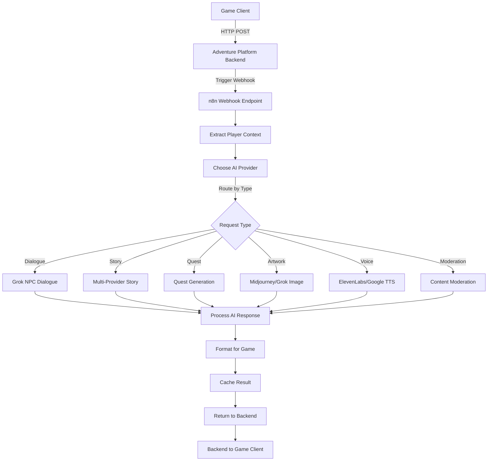

# AI Integration Flow - Adventure Platform

This document explains the complete AI integration flow from game request to AI response.

## Flow Overview

```
Game Client → Backend API → n8n Webhook → AI Provider → Response Processing → Game Client
```

## Detailed Flow Diagram



## 1. Game Request Structure

When the game needs AI-generated content, it sends a request to the backend:

```javascript
POST /api/ai/v2/npc/dialogue
{
  "playerId": "player123",
  "playerName": "Aragorn",
  "playerLevel": 15,
  "playerClass": "Ranger",
  "requestType": "dialogue",
  "content": "Tell me about the ancient ruins",
  "npcName": "Wise Elder",
  "currentLocation": "Temple of Wisdom",
  "worldTheme": "fantasy",
  "worldId": "world456",
  "sessionId": "session789",
  "emotionalState": "curious",
  "inventory": ["sword", "map", "torch"],
  "questProgress": {
    "mainQuest": "chapter3",
    "sideQuests": ["find_artifact", "help_merchant"]
  }
}
```

## 2. Backend Processing

The Adventure Platform backend (`ai-enhanced.routes.js`) processes the request:

```javascript
// Route handler
router.post('/npc/dialogue', async (req, res) => {
  // Validate request
  // Prepare n8n webhook data
  const dialogue = await n8nService.generateNPCDialogue({
    npcName: req.body.npcName,
    playerInput: req.body.content,
    characterContext: extractContext(req),
    emotion: req.body.emotionalState
  });
  
  res.json(dialogue);
});
```

## 3. n8n Webhook Processing

The n8n workflow receives the webhook and processes it through these nodes:

### 3.1 Extract Player Context
- Validates required fields
- Extracts comprehensive game state
- Adds metadata and timestamps

### 3.2 Choose AI Provider
- Determines best provider based on:
  - Request type (dialogue, story, quest, etc.)
  - Provider availability
  - Performance requirements
  - Cost optimization

### 3.3 AI API Request
- Constructs provider-specific prompts
- Includes game context
- Sets appropriate parameters (temperature, tokens, etc.)

### 3.4 Response Processing
- Parses AI responses
- Extracts relevant information
- Handles errors and fallbacks

## 4. AI Provider Integration

### Grok (xAI)
```javascript
{
  "model": "grok-beta",
  "messages": [
    {
      "role": "system",
      "content": "You are an NPC in a fantasy game..."
    },
    {
      "role": "user",
      "content": "Player context + request"
    }
  ],
  "temperature": 0.8,
  "max_tokens": 500
}
```

### OpenAI
```javascript
{
  "model": "gpt-4",
  "messages": [...],
  "temperature": 0.7,
  "max_tokens": 500
}
```

### Claude (Anthropic)
```javascript
{
  "model": "claude-3-opus-20240229",
  "messages": [...],
  "temperature": 0.7,
  "max_tokens": 500
}
```

## 5. Response Formatting

The AI response is formatted for game consumption:

### Dialogue Response
```json
{
  "success": true,
  "requestId": "req_123",
  "dialogue": {
    "npcName": "Wise Elder",
    "text": "Ah, the ancient ruins...",
    "emotion": "thoughtful",
    "choices": [
      {
        "id": "choice_1",
        "text": "Tell me more about their history"
      },
      {
        "id": "choice_2",
        "text": "What dangers lie within?"
      }
    ],
    "questHints": ["Check the northern entrance"]
  },
  "metadata": {
    "provider": "grok",
    "tokensUsed": 245,
    "processingTime": 1234
  }
}
```

### Story Response
```json
{
  "success": true,
  "story": {
    "narrative": "The path diverges ahead...",
    "choices": [...],
    "worldStateChanges": [
      {
        "type": "unlock",
        "target": "secret_passage"
      }
    ],
    "imagePrompt": "Dark forest path diverging..."
  }
}
```

## 6. Caching Strategy

- Responses are cached in Redis
- Cache keys include context for relevance
- TTL varies by request type:
  - Dialogue: 1 hour
  - Story: 1 hour  
  - Artwork: 24 hours
  - Voice: 7 days

## 7. Error Handling

The system includes multiple fallback layers:

1. **Primary Provider Fails** → Try secondary provider
2. **All Providers Fail** → Return cached similar response
3. **No Cache Available** → Return generic fallback content
4. **Webhook Timeout** → Return error with retry guidance

## 8. Performance Optimization

- **Parallel Processing**: Multiple AI requests processed simultaneously
- **Smart Caching**: Context-aware caching reduces API calls
- **Provider Selection**: Automatic routing to fastest available provider
- **Response Streaming**: Large responses streamed to reduce latency

## 9. Security Measures

- **Request Validation**: All inputs sanitized and validated
- **Rate Limiting**: Per-player and per-IP limits
- **API Key Rotation**: Automatic key rotation for security
- **Content Moderation**: All AI outputs pass through moderation

## 10. Monitoring & Analytics

The system tracks:
- Request volumes by type
- Provider performance metrics
- Error rates and types
- Token usage and costs
- Player engagement metrics

## Example Integration Code

### Frontend Request
```javascript
async function requestNPCDialogue(npcName, playerInput) {
  const response = await fetch('/api/ai/v2/npc/dialogue', {
    method: 'POST',
    headers: {
      'Content-Type': 'application/json',
      'Authorization': `Bearer ${authToken}`
    },
    body: JSON.stringify({
      npcName,
      content: playerInput,
      playerId: currentPlayer.id,
      worldId: currentWorld.id,
      currentLocation: currentLocation.name,
      emotionalState: detectPlayerEmotion(playerInput)
    })
  });
  
  const dialogue = await response.json();
  displayNPCResponse(dialogue);
}
```

### Backend Handler
```javascript
async generateNPCDialogue(data) {
  // Check cache first
  const cached = await this.getCached(`npc:${data.npcName}:${data.playerInput}`);
  if (cached) return cached;
  
  // Trigger n8n workflow
  const response = await this.triggerWorkflow(
    process.env.N8N_GROK_NPC_WORKFLOW,
    { data },
    { timeout: 30000 }
  );
  
  // Cache and return
  await this.cacheResponse(cacheKey, response);
  return response;
}
```

## Testing the Flow

### 1. Test Webhook Directly
```bash
curl -X POST https://your-n8n.hostinger.com/webhook/game-ai-request \
  -H "Content-Type: application/json" \
  -d '{
    "playerId": "test123",
    "requestType": "dialogue",
    "content": "Hello there!",
    "npcName": "Innkeeper"
  }'
```

### 2. Test via Backend API
```bash
curl -X POST http://localhost:3000/api/ai/v2/npc/dialogue \
  -H "Content-Type: application/json" \
  -H "Authorization: Bearer YOUR_TOKEN" \
  -d '{
    "npcName": "Merchant",
    "content": "What items do you have for sale?"
  }'
```

## Troubleshooting

### Common Issues

1. **Webhook Not Responding**
   - Check n8n workflow is active
   - Verify webhook URL in .env
   - Check n8n logs

2. **AI Response Timeout**
   - Increase timeout in n8n workflow
   - Check provider API status
   - Verify API keys are valid

3. **Formatting Errors**
   - Check response parsing logic
   - Verify JSON structure
   - Review error logs

### Debug Mode

Enable debug logging:
```javascript
// In .env
DEBUG=adventure:ai:*
N8N_LOG_LEVEL=debug
```

## Future Enhancements

1. **Streaming Responses**: Implement SSE for real-time AI responses
2. **Multi-modal AI**: Add image recognition for visual quests
3. **Voice Input**: Accept voice commands via speech-to-text
4. **Adaptive Difficulty**: AI adjusts based on player performance
5. **Collaborative AI**: Multiple AIs work together for complex scenarios